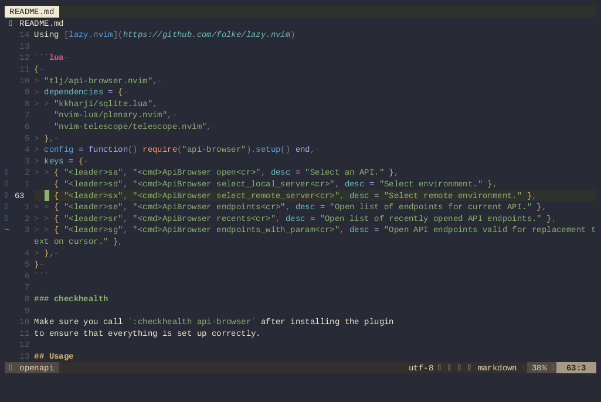

# API Browser for Neovim

[](https://github.com/tlj/api-browser.nvim/actions/workflows/integration.yml)

A [Neovim](https://neovim.io/) plugin to browse API endpoints directly in the
editor.

**BREAKING CHANGE: This plugin has moved from using the bespoke format for describing endpoints, to using OpenAPI. If you still want to use the old format, please lock nvim to using v1.0.0.**

## Features

- Load OpenAPIs in your workspace (:ApiBrowser open).
- Select servers (development/remote) from the servers defined in the OpenAPI (:ApiBrowser select_local_server, :ApiBrowser select_remote_server).
- Select and open endpoints from the selected OpenAPI and server directly in Neovim. (:ApiBrowser endpoints).
- Browse endpoints which have parameter patterns which match the current word (:ApiBrowser endpoints_with_param).
- Load endpoint from 2 selected servers in separate windows with scoll lock, for
  easy diffs by hitting 'd' from normal mode when browsing endpoints.
- Load endpoint in diff view between server 1 and 2
- Debug mode; Opens DAP UI and starts debugging mode on opening an endpoint

## Demo



## Getting started

Use `:checkhealth api-browser` to verify that all required plugins and
binaries are installed correctly.

### Required plugins

- [sqlite.lua](https://github.com/kkharji/sqlite.lua) (required)
- [telescope.nvim](https://github.com/nvim-telescope/telescope.nvim) (required)
- [plenary.nvim](https://github.com/nvim-lua/plenary.nvim) (required)
- [nvim-dap](https://github.com/mfussenegger/nvim-dap) (optional, for debug mode)
- [nvim-dap-ui](https://github.com/rcarriga/nvim-dap-ui) (optional, for debug mode)

### Required binaries

- [neovim](https://neovim.io) (required)
- [jq](https://stedolan.github.io/jq/) (required when fetching JSON endpoints)
- [xmllint](https://gnomes.pages.gitlab.gnome.org/libxml2/xmllint.html)
  (required when fetching XML endpoints)
- [curl](https://curl.se) (required)
- [yq](https://github.com/mikefarah/yq) (required for loading yaml files)
- [rg](https://github.com/BurntSushi/ripgrep) (required for finding OpenAPI files more reliably)

### Installation

Using [lazy.nvim](https://github.com/folke/lazy.nvim)

```lua
{
  "tlj/api-browser.nvim",
  dependencies = {
    "kkharji/sqlite.lua",
    "nvim-lua/plenary.nvim",
    "nvim-telescope/telescope.nvim",
  },
  config = function() 
    require("api-browser").setup() 
  end,
  keys = {
    { "<leader>sa", "<cmd>ApiBrowser open<cr>", desc = "Select an API." },
    { "<leader>sd", "<cmd>ApiBrowser select_local_server<cr>", desc = "Select environment." },
    { "<leader>sx", "<cmd>ApiBrowser select_remote_server<cr>", desc = "Select remote environment." },
    { "<leader>se", "<cmd>ApiBrowser endpoints<cr>", desc = "Open list of endpoints for current API." },
    { "<leader>sr", "<cmd>ApiBrowser recents<cr>", desc = "Open list of recently opened API endpoints." },
    { "<leader>sg", "<cmd>ApiBrowser endpoints_with_param<cr>", desc = "Open API endpoints valid for replacement text on cursor." },
  },
}
```

### Configuration

**api-browser.nvim** comes with the following defaults:

```lua
{
  keep_state = true, -- store state in sqlite db
  ripgrep = {
    -- if ripgrep is installed, use this command to find OpenAPI files
    command = 'rg -l -g \'*.yaml\' -g \'*.json\' -e "openapi.*3"',
    no_ignore = false, -- set --no-ignore for ripgrep to search everything, use this in case you have your openapis in .gitignore
    -- if ripgrep is not installed, use globs to find matching files
    fallback_globs = { "**/*.yaml", "**/*.json" }, 
  }
}
```

### checkhealth

Make sure you call `:checkhealth api-browser` after installing the plugin
to ensure that everything is set up correctly.

## Usage

Use `q` to close endpoint previews from normal mode.

### Pickers

To enter normal mode in the telescope selector, use `<esc>` after selecting
the endpoint you want to work on.

Use `c` in normal mode in any telescope selector for endpoints to open the
endpoint in two windows (selected remote env and selected dev env) for comparison.

Use `d` to open a similar view to `c`, but with diff mode enabled, showing the
differences between the endpoints. The differences can be navigated by using
`[c` and `]c`.

Use `b` to open debug mode. This requires `dap` and `dapui` installed - use 
`:checkhealth api-browser` to verify. Debug mode opens DAP UI and starts 
DAP, then triggers loading the endpoint from the selected base url. When the 
endpoint has finished loading the debugger will stop and the UI will close 
automatically.

### Vim Commands

```vim 
" Select the environment which should be used by default, and as the 
" target environment for diff view
:ApiBrowser select_local_server

" Select the environment which should be used as the source environment
" for the diff view
:ApiBrowser select_remote_server

" Select an OpenAPI to use when using the endpoints selector. 
:ApiBrowser open

" Select from a list of endpoints valid for the API. If an endpoint 
" has a placeholder, the user will be prompted to enter a value. 
:ApiBrowser endpoints

" Select from a list of recently used endpoints. The endpoint is 
" not remembered by base url, so it can be used to quickly open 
" the same endpoint across different base urls. 
:ApiBrowser recents

" Look up current API endpoints with a placeholder with requirements 
" matching the text the cursor is currently on. 
:ApiBrowser endpoints_with_param

### Suggested mappings

```vim 
require('api-browser').setup() 
vim.keymap.set('n', '<leader>sg', '<cmd>ApiBrowser endpoints_with_param<cr>', {}) 
vim.keymap.set('n', '<leader>sr', '<cmd>ApiBrowser recents<cr>', {}) 
vim.keymap.set('n', '<leader>se', '<cmd>ApiBrowser endpoints<cr>', {}) 
vim.keymap.set('n', '<leader>sa', '<cmd>ApiBrowser open<cr>', {}) 
vim.keymap.set('n', '<leader>sd', '<cmd>ApiBrowser select_local_server<cr>', {})
vim.keymap.set('n', '<leader>sx', '<cmd>ApiBrowser select_remote_server<cr>', {})
```

### Database location

The default location for the sqlite3 database is `$XDG_DATA_HOME/nvim` (eq
`~/.local/share/nvim/databases` on linux and MacOS).

# Development

## Running tests

First run the prepare make command to install the test dependencies.

```shell
make prepare vendor
```

Then tests can be run with:

```shell
make test
```

## Mock OpenAPI server

To test fetching endpoints from a server defined by OpenAPI, a good solution is to use the [OpenAPI mocker](https://www.npmjs.com/package/open-api-mocker).

```shell
open-api-mocker -s test/fixtures/petstore.json -w
```

